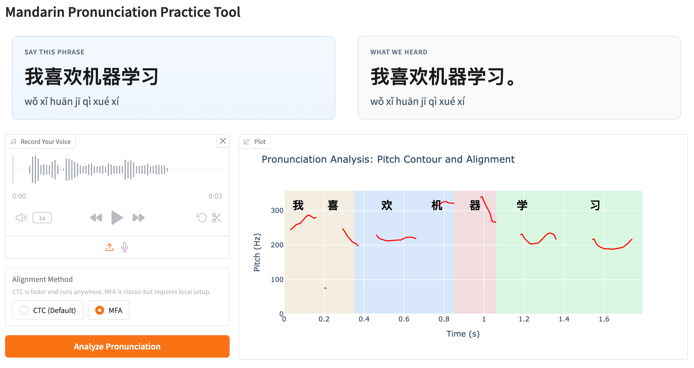

# Mandarin Speech Coach (Prototype)

[](https://github.com/anton-dergunov/mandarin-speech-coach/actions/workflows/unit-tests.yaml)



A web app for **Mandarin pronunciation practice**. Record or upload your voice, compare it to a target phrase, and see **pitch (F0)**, **character-level alignment**, and **tone-colored** segments.

Speech recognition uses **OpenAI Whisper**; alignment defaults to a **Wav2Vec2 CTC** model (no extra tools). **Montreal Forced Aligner (MFA)** is optional for classic forced alignment.

Default target phrase: **我喜欢机器学习** (`wǒ xǐhuān jīqì xuéxí`).

---

## How it works (short)

1. **Record / upload** audio in the browser.
2. **Trim silence**, then **Whisper** transcribes what you said (for comparison).
3. **Forced alignment** maps each character of the target text to a time range:
   - **CTC (default)** — Wav2Vec2 Chinese model with log-prior smoothing.
   - **MFA (optional)** — Montreal Forced Aligner via the `mfa` CLI.
4. **Parselmouth (Praat)** extracts pitch; **Plotly** draws F0 with tone-colored bands.

---

## Project Structure

```text
.
├── apps/
│   └── gradio_demo/          # Gradio Web Application
│       ├── app.py            # Main entry point
│
├── src/
│   └── mandarin_speech_coach/ # Core logic package
│       ├── alignment/         # Forced alignment (CTC, MFA)
│       ├── asr/               # Speech recognition (Whisper)
│       ├── audio/             # Preprocessing (trimming, etc.)
│       ├── core/              # Type definitions and main pipeline
│       ├── models/            # Model registry and lazy loading
│       ├── pitch/             # Pitch extraction (Parselmouth/Praat)
│       ├── tones/             # Pinyin and tone utilities
│       └── visualization/     # Plotly figure builders
│
├── samples/                  # Example audio files for testing
├── Dockerfile                # Full image with MFA + models
└── README.md
```

---

## Requirements

| Component                  | Role                                    |
| -------------------------- | --------------------------------------- |
| **Python** ≥ 3.10          | Runtime                                 |
| **ffmpeg**                 | Audio I/O (used by Gradio / librosa)    |
| **libsndfile**             | Reading/writing WAV (`soundfile`)       |
| **PyTorch + torchaudio**   | Models and audio tensors                |
| **transformers**           | Whisper + Wav2Vec2                      |
| **gradio**                 | Web UI                                  |
| **librosa**, **soundfile** | Load, trim, resample audio              |
| **praat-parselmouth**      | Pitch analysis (bundles Praat bindings) |
| **pypinyin**               | Pinyin with tone marks                  |
| **praatio**                | Read MFA TextGrid output                |
| **plotly**                 | Interactive pitch plot                  |
| **numpy**                  | Numerics                                |

**Optional — MFA only**

| Component                              | Role                                                                  |
| -------------------------------------- | --------------------------------------------------------------------- |
| **Montreal Forced Aligner** (`mfa`)    | CLI aligner ([docs](https://montreal-forced-aligner.readthedocs.io/)) |
| **mandarin_mfa** acoustic + dictionary | Pretrained models (`mfa model download …`)                            |

Hugging Face models (downloaded on first run if not cached):

- `openai/whisper-small` (loaded via **transformers**)
- `jonatasgrosman/wav2vec2-large-xlsr-53-chinese-zh-cn`

### Fonts (optional)

The Gradio UI and Plotly charts usually render Chinese characters without extra setup. If labels or plots show **tofu boxes** (□) on your machine, install a CJK font:

```bash
# macOS (Homebrew)
brew install --cask font-noto-sans-cjk
```

On Linux, install a Noto CJK or Source Han Sans package via your distro. This is only needed for local font rendering.

---

## Install with pip (standard Python)

From the repository root:

```bash
python3 -m venv .venv
source .venv/bin/activate   # Windows: .venv\Scripts\activate
python -m pip install --upgrade pip
python -m pip install .
```

**Editable** install while developing:

```bash
python -m pip install -e .
```

**System packages** (examples):

```bash
# Debian / Ubuntu
sudo apt-get update && sudo apt-get install -y ffmpeg libsndfile1

# macOS (Homebrew)
brew install ffmpeg libsndfile
```

**GPU (optional):** default wheels are CPU-friendly. For CUDA, install matching `torch` / `torchaudio` from [pytorch.org](https://pytorch.org/get-started/locally/) *before* or *after* installing this project, following their matrix for your OS and driver.

**Run:**

```bash
export PYTHONPATH=src:.
python apps/gradio_demo/app.py
```

Open the URL printed in the terminal (default `http://127.0.0.1:7860`).

---

## Install with uv (recommended for speed)

[uv](https://docs.astral.sh/uv/) resolves and installs dependencies quickly from `pyproject.toml`.

```bash
# Create venv and install the project
uv venv
source .venv/bin/activate
uv pip install -e .

# Or run without activating the venv
PYTHONPATH=src:. uv run python apps/gradio_demo/app.py
```

**Reproducible installs** (uses `uv.lock`):

```bash
uv sync
PYTHONPATH=src:. uv run python apps/gradio_demo/app.py
```

---

## Montreal Forced Aligner (optional)

CTC alignment works without MFA. Use MFA only if you select **MFA** in the UI.

Official install path is **Conda / Miniconda** ([installation guide](https://montreal-forced-aligner.readthedocs.io/en/stable/installation.html)):

```bash
conda config --add channels conda-forge
conda create -n aligner -c conda-forge montreal-forced-aligner
conda activate aligner
mfa --help
```

Download Mandarin models (required once per environment):

```bash
mfa model download acoustic mandarin_mfa
mfa model download dictionary mandarin_mfa
```

Verify:

```bash
mfa model inspect acoustic mandarin_mfa
mfa model inspect dictionary mandarin_mfa
```

**Chinese tokenization** (required for Mandarin MFA; install inside the `aligner` conda env):

```bash
conda activate aligner
pip install "spacy-pkuseg>=0.0.33" dragonmapper hanziconv
# Or from this repo: pip install -e ".[mfa]"
```

If you hit `numpy.dtype size changed` after installing pkuseg, pin an older pkuseg build:

```bash
pip install "spacy-pkuseg==0.0.33" dragonmapper hanziconv
```

Keep MFA updated (fixes many Mandarin alignment bugs):

```bash
conda update -c conda-forge montreal-forced-aligner kalpy
```

Run the app with `mfa` on your `PATH` in the **same terminal** as the Python app:

```bash
conda activate aligner          # or your MFA env name
source .venv/bin/activate       # project venv
export PYTHONPATH=src:.
python apps/gradio_demo/app.py
```

Quick sanity check (uses a tiny temp recording; should print MFA version info, not fail immediately):

```bash
mfa model inspect dictionary mandarin_mfa
mfa model inspect acoustic mandarin_mfa
```

**CLI test** (transcript must match what is spoken, and use dictionary words only):

```bash
printf '%s' "我 喜 欢 机 器 学 习" > /tmp/test.lab
mfa align_one --clean --no_tokenization -j 1 \
  /path/to/your.wav /tmp/test.lab mandarin_mfa mandarin_mfa /tmp/out.TextGrid
```

`RuntimeError: kaldi::KaldiFatalError` during alignment usually means:

1. **Transcript mismatch** — `.lab` text does not match the audio (or is empty / English / wrong encoding).
2. **Out-of-vocabulary characters** — a character in the `.lab` file is not in `mandarin_mfa` (check with `mfa validate` on a small corpus).
3. **`align_one` + mandarin_mfa** — known issues; try batch align instead:

```bash
mkdir -p /tmp/mfa_corpus/speaker
cp /path/to/your.wav /tmp/mfa_corpus/speaker/utt1.wav
cp /tmp/test.lab /tmp/mfa_corpus/speaker/utt1.lab
mfa align --clean --single_speaker --no_tokenization -j 1 \
  /tmp/mfa_corpus mandarin_mfa mandarin_mfa /tmp/mfa_out
```

If MFA remains unreliable, use **CTC (Default)** in the UI — it does not need conda or Chinese tokenization.

**Environment overrides** (defaults match the commands above):

| Variable             | Default        | Meaning                             |
| -------------------- | -------------- | ----------------------------------- |
| `MFA_ACOUSTIC_MODEL` | `mandarin_mfa` | Acoustic model name for `mfa align` |
| `MFA_DICTIONARY`     | `mandarin_mfa` | Dictionary name for `mfa align`     |

**Note:** MFA pulls in Kaldi and other native tooling via Conda. It is intentionally **not** listed in `pyproject.toml`; use Conda for MFA, or use the **Docker** image below.

---

## Docker (all-in-one, including MFA)

The `Dockerfile` installs Python dependencies, pre-downloads Hugging Face models, installs MFA via Conda, and fetches `mandarin_mfa` models. The first build can take a long time and needs several GB of disk.

```bash
docker build -t mandarin-speech-coach .
docker run --rm -p 7860:7860 mandarin-speech-coach
```

Or with Compose:

```bash
docker compose up --build
```

Then open `http://127.0.0.1:7860`.

**Useful environment variables in containers:**

| Variable | Default in image | Purpose |
|----------|------------------|---------|
| `GRADIO_SERVER_NAME` | `0.0.0.0` | Listen on all interfaces |
| `GRADIO_SERVER_PORT` | `7860` | HTTP port |
| `GRADIO_DEBUG` | `0` | Set to `1` for Gradio debug mode |
| `HF_HOME` | `/apps/.cache/huggingface` | Model cache directory |

---

## Other ways to simplify setup

| Approach | When to use |
|----------|-------------|
| **Docker / Compose** (above) | Avoid local Conda, ffmpeg, and MFA setup |
| **`uv sync` + committed `uv.lock`** | Fast, reproducible local/CI installs |
| **CTC only** | Skip MFA entirely; smallest local install |
| **Pre-download models** | Run once: `python -c "from transformers import ..."` (see `Dockerfile`) to avoid first-run delay |
| **Make / script wrapper** | Optional `make run` → `uv run python apps/gradio_demo/app.py` for one command |
| **Dev Container** | Optional `.devcontainer/` for VS Code / Cursor with extensions and `postCreateCommand: uv sync` |

---

## Testing

Ensure you have installed the test dependencies:

```bash
pip install .[test]
```

Then run the tests using `pytest`:

```bash
export PYTHONPATH=src
pytest tests/unit
```

---

## License

MIT (see `pyproject.toml`). Hugging Face and MFA models have their own licenses; check their model cards before redistribution.
